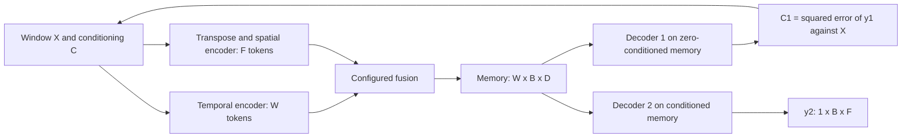

# AdvSTAD implementation plan

Add `AdvSTAD` as a new TranAD-derived model with independent temporal and spatial encoders, configurable fusion, and two reconstruction decoders trained with opposing objectives. This document specifies future work only; it does not implement model, training, or configuration changes.

## 1. Existing behavior and design decisions

The baseline is `TranAD` in `src/models.py`, using the custom attention layers and positional encoding in `src/dlutils.py`.

| Existing integration point | Current behavior | Planned AdvSTAD behavior |
| --- | --- | --- |
| `TranAD.__init__` / `encode` | Temporal attention over windows; hidden width `2F`; `F` attention heads; one encoder | Retain the temporal route and add a separate encoder whose tokens are sensors |
| `TranAD.forward` | Zero conditioning, decoder 1 reconstruction, squared-error conditioning, decoder 2 reconstruction | Repeat both encoder routes and fusion with the updated conditioning |
| Decoder output projection | One shared `Linear(2F,F) + Sigmoid` head | Separate heads for the two decoders so adversarial parameter ownership is unambiguous |
| `main.py::backprop`, TranAD branch | Minimizes `(1/n) MSE(y1,target) + (1-1/n) MSE(y2,target)` | Add a dedicated alternating adversarial update; the existing positive weighted loss is not an opposing optimization game |
| `main.py::load_model` | Discovers classes with `getattr(src.models, modelname)` and constructs them with feature count only | Pass validated AdvSTAD settings into its constructor |
| Windowing and training dispatch | Several checks recognize the substring `TranAD` | Explicitly recognize `AdvSTAD`; its name will not match those checks |

Use endpoint reconstruction, as in this repository's TranAD: the target observation is available inside the window and is supplied as the decoder query. This is anomaly detection through reconstruction, not next-step forecasting. Both encoders can attend over the entire observed window; there is no causal or padding mask in the initial design. Repeated initial observations are valid context.

Retain the existing TranAD implementations and their checkpoint formats. The proposed adversarial objective below is an AdvSTAD design choice, not a claim that the current implementation already trains this way or an exact reproduction of every procedure mentioned in its comments. MAML is outside this change.

## 2. Tensor contract and timestamp alignment

Notation: `N` observations, `W` window length, `B` actual minibatch size, `F` sensors, `D` common embedding width, and `H` attention heads. All attention layers use sequence-first tensors.

| Tensor | Shape | Meaning |
| --- | --- | --- |
| Raw series | `[N,F]` | Existing processed dataset |
| Windowed dataset | `[N,W,F]` | One window per scored timestamp |
| Loader minibatch | `[B,W,F]` | Includes a possibly smaller final batch |
| `src = X` | `[W,B,F]` | Minibatch permuted with `(1,0,2)` |
| `tgt = Y = X[-1:]` | `[1,B,F]` | Endpoint reconstruction target/query input |
| Conditioning `C` | `[W,B,F]` | Zero in phase 1; squared residuals in phase 2 |
| Temporal tokens `T` | `[W,B,D]` | One token per time position |
| Spatial tokens `S` | `[F,B,D]` | One token per sensor |
| Fused memory `M` | `[W,B,D]` | Identical decoder interface for every fusion method |
| Decoder query `Q` | `[1,B,D]` | Embedded target |
| `y1`, `y2`, auxiliary `y2_base` | `[1,B,F]` each | Endpoint reconstructions |
| Evaluation scores and predictions | `[N,F]` each | Per-timestamp, per-sensor outputs |

Default `D=2F` and `H=F`, preserving TranAD's temporal dimensions. Configuration may override both; require `D % H == 0`. Sensor count and window length need not be equal or individually divisible by `H`, because both routes project to `D` before attention. Feature count is inferred from the data, not entered independently in YAML.

**Resolve the existing timestamp mismatch for AdvSTAD.** The current `convert_to_windows` prepends `W` observations and starts its view at offset zero. Thus window `i` ends at observation `i-1` (with initial repetition), while downstream metrics compare score `i` with label `i`. The plot-only `torch.roll` does not fix that metric alignment.

For AdvSTAD, use inclusive windows `X_i = [x[max(0,i-W+1)], ..., x[i]]`, repeating `x[0]` where indices would be negative. Prepend `W-1` copies of the first observation and retain the memory-efficient overlapping view. Then `X_i[-1] = x[i]`, with exactly `N` predictions and matching labels. For `W=3`, the first three windows are `[x0,x0,x0]`, `[x0,x0,x1]`, and `[x0,x1,x2]`. Handle `W=1` and series shorter than `W` explicitly. Never modify the overlapping view in place.

Apply this alignment to AdvSTAD training, test scoring, and training-score calibration. Plot its unshifted observations. Preserve the legacy TranAD window convention in its existing path and record this difference when comparing results.

## 3. Dual encoder architecture

Define an internal interface `encode(src, conditioning) -> memory`, used with the same parameters in both conditioning phases.

**Temporal route**

1. Concatenate observations and conditioning on the feature axis: `cat([X,C], dim=-1) -> [W,B,2F]`.
2. Apply `temporal_input_projection: 2F -> D`; use `Identity` when `D=2F` to preserve the baseline input transformation.
3. Multiply by `sqrt(F)` and apply the repository's `PositionalEncoding(D, dropout, max_len=W)` along the time-token axis. Keep its existing encoding formula rather than silently changing the baseline.
4. Apply an independently initialized stack of temporal Transformer encoder layers, producing `T: [W,B,D]`.

**Spatial route**

1. Transpose each original tensor separately: `X.permute(2,1,0)` and `C.permute(2,1,0)` each have shape `[F,B,W]`.
2. Concatenate their history vectors: `cat([X_spatial,C_spatial], dim=-1) -> [F,B,2W]`. Each token remains one sensor with its observation history and conditioning history. Transposing the temporal concatenation would incorrectly make observations and conditioning separate sensor tokens.
3. Apply `spatial_input_projection: Linear(2W,D)`, scale by `sqrt(W)`, add a learned sensor-identity embedding `[F,1,D]`, and apply dropout.
4. Apply a separate spatial Transformer encoder stack, producing `S: [F,B,D]`. Its self-attention compares sensors, with conceptual attention weights `[B,H,F,F]`; temporal self-attention instead has `[B,H,W,W]`.

History order is encoded by the fixed ordered input coordinates of `Linear(2W,D)`. Sensor embeddings identify dataset columns without asserting that adjacent columns are physically adjacent. Sensor order must remain consistent between training and inference; different feature sets or window lengths require a compatible new model/checkpoint.

Use the repository's custom residual attention/LeakyReLU blocks to retain TranAD-like behavior. For AdvSTAD, assemble independently constructed blocks in registered `nn.ModuleList` stacks and call them directly, avoiding dependency on compatibility between those custom blocks and newer `nn.TransformerEncoder`/`Decoder` wrappers. This preserves the custom layers' lack of layer normalization. Do not replace the existing baseline blocks with stock Transformer layers as part of this addition.

The compatibility concern is concrete: the local custom forward signatures lack causal-hint arguments present in the documented stock [encoder layer](https://docs.pytorch.org/docs/2.14/generated/torch.nn.TransformerEncoderLayer.html) and [decoder layer](https://docs.pytorch.org/docs/2.14/generated/torch.nn.TransformerDecoderLayer.html) APIs. Verify against the actual installed PyTorch version during implementation; `requirements.txt` currently does not pin PyTorch. Fixed complete windows let this initial model call the custom blocks without masks.

## 4. Fusion interface and selectable methods

Define a registered module `SpatioTemporalFusion(method, n_feats=F, n_window=W, d_model=D, nhead=H, dropout=p)` with the public contract:

`forward(temporal: [W,B,D], spatial: [F,B,D]) -> memory: [W,B,D]`

Validate rank, token counts, batch size, embedding width, and compatible dtype/device. The model and decoders only consume this contract; fusion selection belongs inside this module. Construct the selected method's parameters once in `__init__`.

**Alignment for sum and concatenation.** The two encoder outputs have different token axes. Define a learned adapter inside these two fusion variants:

`S [F,B,D] -> Linear(D,W) -> [F,B,W] -> permute(2,1,0) -> [W,B,F] -> Linear(F,D) -> S_time [W,B,D]`.

The first projection produces a value for each window position from each contextualized sensor token; the second embeds the sensors at each position into the temporal memory width. This is a learned alignment, not a lossless inverse of the spatial input projection. A transpose alone cannot align `[F,B,D]` with `[W,B,D]`. Each sum/concat model has its own trainable adapter with the same architecture.

| `advstad.fusion` | Operation | Output |
| --- | --- | --- |
| `sum` | `M = T + S_time` | `[W,B,D]` |
| `concat` | `M = Linear(2D,D)(cat([T,S_time], dim=-1))`; concatenated shape `[W,B,2D]` | `[W,B,D]` |
| `cross_attention` | `A = MultiheadAttention(D,H)(query=T, key=S, value=S, need_weights=False)[0]`; `M = T + Dropout(A)` | `[W,B,D]` |

Cross-attention uses temporal queries and the native sensor tokens directly; it does not instantiate the spatial alignment adapter. The attention map is conceptually `[B,H,W,F]`, and softmax runs over sensors for each temporal query. Its residual retains the temporal representation. Use `batch_first=False` consistently and take the attention-output tensor from the returned tuple. PyTorch supports distinct query and key/value sequence lengths and returns the query length, so this interface also works when `W != F`. [MultiheadAttention API](https://docs.pytorch.org/docs/2.14/generated/torch.nn.MultiheadAttention.html).

Instantiate only the parameters used by the selected mode, so optimizers do not contain dormant fusion branches. Do not add an extra normalization or activation after sum/concat in the initial comparison: sum is a literal element-wise sum, and concat is followed by the specified linear transformation.

## 5. Two decoders and self-conditioning

Create separate Transformer stacks `decoder1` and `decoder2`, each operating at width `D`, with independent output heads `head1` and `head2`: `Linear(D,F) + Sigmoid`. Retain sigmoid as the baseline output choice; inspect the existing processed-data ranges when interpreting reconstruction error, since all datasets and injected anomalies are not guaranteed to stay in `[0,1]`. Do not clip evaluation observations to fit the output range.

Build `Q` by repeating `Y` across features to `[1,B,2F]`, then using `target_projection: Identity` if `D=2F`, otherwise `Linear(2F,D)`. Decoder self-attention has one query token; decoder-to-memory attention covers the `W` fused memory tokens.

The forward sequence is:

1. `C0 = zeros_like(X)`; `M0 = encode(X,C0)`.
2. `y1 = head1(decoder1(Q,M0))`, shape `[1,B,F]`.
3. `C1 = (y1 - X).square()`, shape `[W,B,F]`. Broadcasting repeats the endpoint prediction across the window. This exactly describes the repository's conditioning rule; `y1` is not a full-window reconstruction.
4. `M1 = encode(X,C1)`, recomputing both encoders and fusion with the same weights.
5. `y2 = head2(decoder2(Q,M1))`, shape `[1,B,F]`.

Public `forward(src,tgt)` returns `(y1,y2)`, preserving the familiar inference interface. An explicit `return_aux=True` training interface returns named tensors `{y1, y2, y2_base}`, where `y2_base = head2(decoder2(Q,M0))`. This auxiliary zero-conditioned reconstruction reuses decoder 2 and adds no third decoder. Internal helpers should expose query construction and decoding from prepared memories to support the update rules below.

During generator training, keep `C1` attached to autograd: decoder 2's conditioned error must reach decoder 1 through the squared-error computation. Use fresh local conditioning for every minibatch and inference call; never use labels or state from a previous batch.



The diagram's feedback edge denotes one additional encoder/fusion pass, not an iterative loop to convergence. Decoder 2 also reads zero-conditioned memory for its training-only reconstruction anchor.

## 6. Adversarial objectives and optimizer ownership

Use decoder 2 as a reconstruction adversary: it learns to reconstruct from zero-conditioned memory while increasing the conditioned reconstruction error; the shared representation and decoder 1 learn to reduce that conditioned error. No binary discriminator or classification loss is needed.

Let `ell(a,Y) = mean((a-Y)^2)` over batch and sensors, `n = epoch + 1 >= 1`, and `alpha_n = adversarial_weight * (1 - 1/n)`. Choose these explicit objectives:

`L_G = ell(y1,Y) + alpha_n * ell(y2,Y)`

`L_A = ell(y2_base,Y) - alpha_n * ell(y2,Y)`

Both optimizers minimize their own objective. The conditioned error therefore has opposing signs for different parameter groups. At the first epoch, `alpha_1=0` and both decoders learn their direct reconstruction anchors. Later epochs introduce the opposing term, using the absolute resumed epoch rather than restarting the schedule.

Keep the reconstruction-anchor coefficients at one and start with `adversarial_weight=0.1`. This adopts TranAD-like growth of the second-phase contribution while avoiding reconstruction anchors that vanish as `1/n`. It is a proposed training extension, with no guarantee of improved anomaly detection. Log all three unsigned reconstruction errors to detect an adversary that merely saturates its output; signed `L_A` is not an anomaly score or model-selection metric.

| Parameter group | Owner | Update objective |
| --- | --- | --- |
| Both encoders, input/query projections, sensor embeddings, fusion and its adapters, decoder 1 and head 1 | `optimizer_g` | `L_G` |
| Decoder 2 and head 2 | `optimizer_a` | `L_A` |

Groups must be disjoint and together cover every trainable parameter. Positional-encoding buffers follow model device/dtype but are not optimizer parameters. Do not include the shared encoder in both AdamW optimizers, and do not minimize `L_G + L_A`: their opposing terms would cancel.

For each minibatch, perform one adversary update followed by one generator update:

1. Set training mode and clear both optimizers' gradients. Freeze the generator group; prepare `Q`, `M0`, `y1`, `C1`, and `M1` without a generator graph. Outside that no-grad region, evaluate decoder 2 on detached `Q/M0/M1`, backpropagate `L_A`, optionally clip the adversary gradients, and step only `optimizer_a`.
2. Clear both gradient sets again, unfreeze the generator group, and freeze decoder 2/head 2 parameters. Recompute a fresh full forward pass after the adversary update. Backpropagate `L_G`, clip the generator gradients if configured, and step only `optimizer_g`. Do not put decoder 2 under `no_grad` in this step: its operations must propagate gradients into `M1` and onward through `C1` to decoder 1.
3. Restore parameter flags, including on exceptions. No retained graph or backward through pre-update parameters is needed. Step each learning-rate scheduler once after the completed epoch, not per substep.

Use the existing AdamW defaults (`weight_decay=1e-5`) and StepLR policy (`step_size=5`, `gamma=0.9`) for both optimizers initially. Resolve their common starting learning rate from the current dataset-specific `lr_d` unless overridden. Keep the same training-mode dropout policy in both substeps; freezing parameters does not itself switch modules to evaluation mode.

Report sample-weighted epoch means for `ell(y1,Y)`, `ell(y2_base,Y)`, `ell(y2,Y)`, `L_G`, `L_A`, `alpha_n`, and both learning rates. Keep `(L_G, generator_lr)` available for the existing training-curve interface and label it as the generator objective.

## 7. Configuration changes

Extend the root `config.yaml` with the following proposed mapping while retaining existing device, dtype, and experiment-tracking settings:

```yaml
advstad:
  window_size: 10
  batch_size: 128
  d_model: null              # resolve to 2 * number of sensors
  nhead: null                # resolve to number of sensors
  temporal_layers: 1
  spatial_layers: 1
  decoder_layers: 1          # depth of each of the two separate decoders
  dim_feedforward: 16
  dropout: 0.1
  fusion: sum               # sum | concat | cross_attention
  training:
    epochs_per_run: 5
    learning_rate: null      # use the existing dataset-specific learning rate
    adversarial_weight: 0.1
    gradient_clip_norm: 1.0  # null disables clipping
```

Add `get_advstad_config(config, feats, default_lr)` in `src/config.py` to merge defaults, resolve data-dependent settings, and return a plain resolved mapping. Pass that mapping into `AdvSTAD(feats, config)` from `load_model`. Give the model the established attributes `name='AdvSTAD'`, `n_feats`, `n_window`, `batch`, `lr`, and optionally `n=F*W`, plus its resolved configuration for tracking.

Validate only the selected model's settings: nested values must be mappings; fusion must exactly match the three supported strings; window/batch/dimensions/depths/epochs/heads must be positive integers excluding booleans; `D % H == 0`; dropout must be finite and in `[0,1)`; learning rate and enabled clip norm must be finite and positive; adversarial weight must be finite and in `[0,1]`. Weight zero is a useful training ablation. Reject unknown AdvSTAD keys so a misspelled fusion setting does not silently fall back. Missing `advstad` uses the documented defaults; other model constructors remain compatible.

No new model-selection parser machinery is needed: `--model AdvSTAD` is already accepted. Update help/examples for discoverability. Resolve feature count against the train/test/label shapes and reject disagreements before model construction. Honor the existing `DEVICE` and `DTYPE`; create tensors using `zeros_like`, existing tensors, registered buffers, and model parameters rather than hardcoded CUDA or float64 allocations.

## 8. Required file and pipeline changes

| File | Planned changes |
| --- | --- |
| `src/models.py` | Add the public `AdvSTAD` class and `SpatioTemporalFusion`; create the two encoder/two decoder stacks, projections, sensor embeddings, separate heads, shape checks, and explicit forward/helper interfaces |
| `src/dlutils.py` | Reuse the existing positional encoding and custom layer primitives; no baseline layer rewrite is required with the direct-stack design |
| `src/advstad_training.py` (new) | Isolate optimizer parameter partitioning, alternating minibatch updates, gradient restoration, objective schedule, and per-objective metrics from the legacy training branches |
| `src/config.py`, `config.yaml` | Add and validate the settings above; expose resolved configuration |
| `main.py::load_model` | Pass AdvSTAD settings and construct its named optimizers/schedulers; preserve existing construction for other models |
| `main.py::convert_to_windows`, `run_experiment` | Recognize AdvSTAD as windowed with `[N,W,F]` layout and inclusive endpoint alignment in every train/test path; use configured epochs for this model |
| `main.py::backprop` | Add dedicated AdvSTAD dispatch that prepares `[W,B,F]`/`[1,B,F]` minibatches, calls the training helper or inference path, and uses the actual final-batch size |
| `main.py::save_model`, `load_model` | Support the new versioned checkpoint payload and named optimizer/scheduler states described below |
| `src/experiment_tracking.py` | Record resolved architecture/training settings, both optimizers/schedulers and learning rates, and the separate unsigned errors and signed objectives; preserve existing tracker calls for other models |
| `src/constants.py` | Explicitly include AdvSTAD in the TranAD POT-parameter-table choice as the initial baseline policy; its name does not match the current substring check |
| `src/parser.py`, `README.md` | Document model selection, fusion choices, two-phase reconstruction, the objective extension, aligned windows, and checkpoint/run identifiers |
| Future focused tests | Cover the acceptance checks below without requiring a full benchmark run |

**Inference and anomaly scoring.** Use `model.eval()` and the existing no-grad evaluation boundary. Run both conditioning phases; return `prediction = y2[0]` and `score = (y2-Y).square()[0]` for each batch. Accumulate on CPU and concatenate to `[N,F]`, preserving row order. Use the same scoring function on training data to supply POT's reference distribution. Feed featurewise scores into POT and diagnosis and retain the existing mean-across-sensors overall score. Do not reduce sensors before producing `[N,F]` or use signed adversarial training losses as scores. Labels enter metrics only. Keep all AdvSTAD arrays aligned without the TranAD plot roll.

**Checkpoint and artifact compatibility.** Add an AdvSTAD-specific schema version and save model state, resolved configuration, `F`, sensor order/identifiers when available, window-alignment policy, objective/schedule version, completed epoch, both optimizer/scheduler states, and training history. Retain atomic temporary-file replacement and optimizer-state device/dtype migration. Validate metadata before loading weights or optimizer state, including fusion type and head count: a matching tensor shape alone does not prove architectural compatibility.

Use one helper to derive an AdvSTAD experiment key from dataset, fusion, and a stable fingerprint of resolved architecture/training semantics, including `F`, `W`, alignment, and objective version. Use that key consistently for checkpoint paths, training/evaluation plot paths, and tracker artifact references so fusion experiments do not overwrite one another. Exclude labels such as run name and runtime device/dtype from that fingerprint; keep epochs-per-run separate from the objective's absolute epoch state. Preserve existing paths/payload handling for legacy models. Reject mismatched AdvSTAD checkpoints with an actionable explanation rather than loading with `strict=False`. A new model starts from scratch; converting TranAD weights is outside this plan.

## 9. Implementation order and acceptance checks

1. Add configuration resolution and the model/fusion interfaces, then verify the dimensional contracts in isolation.
2. Implement the alternating update helper and prove parameter ownership and gradient flow before connecting it to the experiment runner.
3. Connect AdvSTAD windowing, construction, batching, evaluation, checkpointing, tracking, and POT policy.
4. Add focused tests and update the README; run small smoke experiments for all fusion methods before longer comparisons.

The future implementation is ready when these checks pass:

- **Fusion and model shapes:** all three modes with unequal `W`/`F`, odd sensor count, `B=1`, `W=1`, `F=1`, a short final minibatch, and an explicitly configured valid `D/H`. Example baseline case: `W=10`, `B=4`, `F=7`, `D=14`, `H=7`; memories must be `[10,4,14]` and predictions `[1,4,7]`. Verify numerical sum/concat interfaces and that cross-attention attends over sensor tokens.
- **Sample isolation and spatial dependence:** in evaluation mode, changing another sample in the batch must not change the first sample's output. A perturbation of one sensor should be able to affect another sensor token after spatial attention. Check the actual attention inputs, so a swapped batch/token axis cannot pass merely by returning the expected shape.
- **Conditioning and gradients:** phase 1 receives zeros; phase 2 receives the exact broadcast squared residual for both routes. With `n>1` and a nondegenerate fixture, conditioned loss reaches decoder 1 and both encoders during the generator step. Frozen groups stay unchanged; active groups update; optimizers have no overlapping parameters. Isolate the conditioned term to verify its opposite gradient signs for the two objectives.
- **Window/label alignment:** numbered-series fixtures verify first, interior, and last window endpoints, all `N` score rows, `N<W`, and `W=1`. Evaluation, train-score calibration, labels, and plotted observations must refer to the same timestamps. Confirm the legacy TranAD path remains unchanged.
- **Configuration errors:** invalid fusion, mapping types, nonpositive settings, invalid head divisibility, nonfinite coefficients, and unknown keys fail before training. Confirm default resolution and the zero-adversarial-weight ablation.
- **Execution:** CPU float32 and float64 forward/backward and one complete adversary-plus-generator minibatch update for each mode, including finite losses and gradients; CUDA smoke check when available. Compare batched versus individually evaluated outputs with dropout disabled, within numerical tolerance.
- **Persistence and integration:** a save/load round trip preserves evaluation outputs, both optimizer/scheduler states, and the next epoch's objective coefficient; incompatible fusion/dimensions/head count are rejected. Test-only mode yields `[N,F]` outputs, uses inclusive windows for both datasets, and logs artifacts under the correct configuration key. Existing model loading/tracking calls remain supported.

Compare fusion methods using the same data, seed, dimensions, window policy, training duration, and score definition. Report parameter counts and time/memory alongside detection metrics: temporal attention scales quadratically in `W`, spatial attention in `F`, and cross-fusion attention uses `W*F` pairs per head. Both conditioning passes and both optimizer substeps increase cost relative to the existing single-route training path. A short smoke run establishes correctness, not a quality improvement; quality claims require measured experiments.
